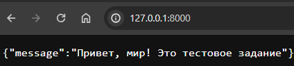
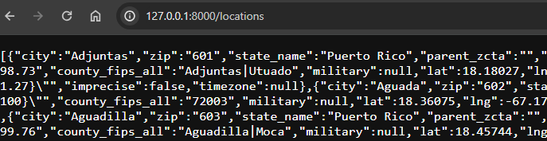
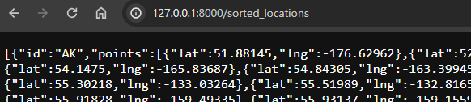
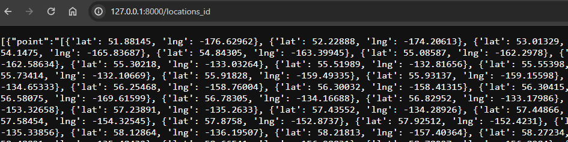
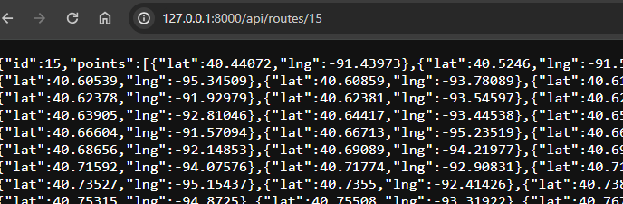

# Тестовое задание web-программист Python (Middle) (2024)

### Описание проекта
🔥 **Создать FastAPI приложение для расчёта оптимального маршрута**
**POST /api/routes** - создание маршрута
**GET /api/routes/{id}** - получение маршрута по id
В endpoint POST /api/routes?format=csv загружается csv файл с точками маршрута: пример файла:
Первая точка в массиве является стартом маршрута.
Из переданных точек нужно составить оптимальный маршрут и вернуть его в следующем виде:
- Напишите небольшой юнит-тест на проверку работы функции вычисления оптимального маршрута.
- Оформите приложение в виде docker-compose.yml. Для хранения данных о маршрутах/точках используйте PostgreSQL, которая также указана как сервис в docker-compose.yml
- Оформите решение в виде приватного репозитория на одной из площадок (GitHub, GitLab, Bitbucket).
- Опишите, каких endpoint-ов и методов не хватает в рамках REST API.

### Установка
Клонируйте репозиторий:

git clone https://github.com/Mikforce/test_routs.git
Перейдите в директорию проекта:

cd your_project

соберите проект
docker build -t your-image-name .
запустите контейнер
docker run -p 8000:8000 your-image-name

## Использование
Запустите приложение:

python main.py
Откройте браузер и перейдите на http://localhost:8000 для доступа к приложению.

python zapros.py # запрос на загрузку csv
Пример запроса на передачу файла с использованием Postman:

Откройте Postman.
Создайте новый запрос, выбрав метод POST.
Укажите URL вашего сервера, к примеру: http://127.0.0.1:8000/upload_route.
В разделе Body выберите тип данных "form-data".
Добавьте новый параметр со значением "file". Выберите "File" вместо "Text" и выберите ваш CSV файл.
Нажмите Send, чтобы отправить запрос.

GET запрос для '/': Возвращает сообщение "Привет, мир! Это тестовое задание" при обращении к корневому URL.

POST запрос для '/upload_route': Принимает CSV файл с данными о расположениях, обрабатывает его и сохраняет данные в базу данных.

GET запрос для '/locations': Возвращает все расположения из базы данных.

GET запрос для '/sorted_locations': Сортирует расположения по state_id и сохраняет их в другую таблицу Location_id.

GET запрос для '/locations_id': Возвращает все записи из таблицы Location_id.

GET запрос для '/api/routes/{id}': Возвращает оптимальный маршрут по заданному id.

DELETE запрос для '/api/routes/{id}': Удаляет маршрут по id.

DELETE запрос для '/api/routes/delete_all': Удаляет все маршруты из таблицы Location_id.

Юнит-тест на проверку работы функции вычисления оптимального маршрута
python test.py

## Опишите, каких endpoint-ов и методов не хватает в рамках REST API.

Endpoint: PUT /locations/{id}
Method: PUT позволяет обновлять сведения о конкретном местоположении, определенном его идентификатором.

Endpoint: GET /locations?state={state}&population_gt={value}
Method: GET Описание. Выбор местоположений на основе определенных критериев, таких как название штата и минимальный порог численности населения.

Endpoint: PUT /locations/update_from_csv
Method: PUT Разрешить обновление данных о местоположении в базе данных путем загрузки нового файла CSV.

Добавить конечные точки для регистрации, аутентификации и авторизации пользователей, чтобы повысить безопасность и контролировать доступ к определенным функциям API.
Внедрите конечные точки, которые позволяют фильтровать и сортировать местоположения на основе различных атрибутов, таких как население, плотность и т.д.

README.md: Файл с описанием проекта.

## Технологии
Python
FastAPI
sqlalchemy

## Автор
Толпеев Иван Васильевич
